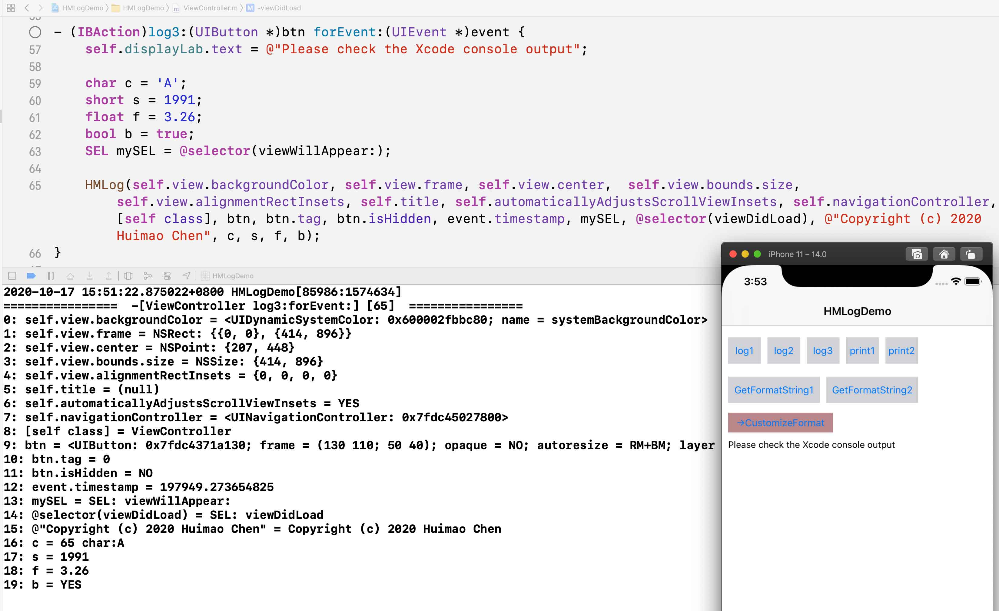

**HMLog** can format and print variables automatically, it contains only one header file(`HMLog.h`).  
[中文介绍](https://juejin.im/post/6886794691879108615)

## Requirements

- Work on Xcode, Objective-C language
- Foundation and UIKit framework
- gnu99 standard

## Installation
Download and add the HMLog.h file to your Xcode project. Include HMLog.h wherever you need it with `#import "HMLog.h"`.

## Example

### HMLog

HMLog is based on NSLog:

```objective-c
UIView *view = [[UIView alloc] initWithFrame:CGRectMake(10, 20, 30, 40)];
view.tag = 333;
HMLog(view.frame);
HMLog(view.frame, view.tag, view.isHidden);

// 2020-10-17 15:49:33.356890+0800 HMLogDemo[85956:1573131] 
// ================  -[ViewController viewDidLoad] [45]  ================
// 0: view.frame = NSRect: {{10, 20}, {30, 40}}
// 2020-10-17 15:49:33.357017+0800 HMLogDemo[85956:1573131] 
// ================  -[ViewController viewDidLoad] [46]  ================
// 0: view.frame = NSRect: {{10, 20}, {30, 40}}
// 1: view.tag = 333
// 2: view.isHidden = NO
```
Another example(screenshot from the Demo project):


### HMPrint
HMPrint is based on printf:

```objective-c
UIView *view = [[UIView alloc] initWithFrame:CGRectMake(10, 20, 30, 40)];
view.tag = 333;
HMPrint(view.frame);
HMPrint(view.frame, view.tag, view.isHidden);

// ================  -[ViewController viewDidLoad] [45]  ================
// 0: view.frame = NSRect: {{10, 20}, {30, 40}}
// 
// ================  -[ViewController viewDidLoad] [46]  ================
// 0: view.frame = NSRect: {{10, 20}, {30, 40}}
// 1: view.tag = 333
// 2: view.isHidden = NO
```

### HMFormatString
HMFormatString is used to get the formatted string:

```objective-c
self.displayLab.text = HMFormatString(self.view.frame, self.view.tag, @selector(viewDidLoad));
printf("%s", self.displayLab.text.UTF8String);

// ================  -[ViewController getFormatString1] [80]  ================
// 0: self.view.frame = NSRect: {{0, 0}, {414, 896}}
// 1: self.view.tag = 0
// 2: @selector(viewDidLoad) = SEL: viewDidLoad
```

## Examples of optional parameters

### HMLogEnable / HMPrintEnable

```objective-c
// Only enable HMPrint in Debug configuration
#ifdef DEBUG
#define HMPrintEnable 1
#else
#define HMPrintEnable 0
#endif
#import "HMLog.h"
```

### HMLogHeaderFormatString

```objective-c
#define HMLogHeaderFormatString(FUNC, LINE) \
        [NSString stringWithFormat:@"%s  ?????  %s:\n", FUNC, FUNC]
#import "HMLog.h"
...

HMPrint(self.navigationItem.title);
HMPrint(self.view.bounds.size, self.view.alignmentRectInsets, self.title, self.automaticallyAdjustsScrollViewInsets, self.navigationController, [self class], @selector(viewDidAppear:));

// -[ViewController print2]  ?????  -[ViewController print2]:
// 0: self.navigationItem.title = HMLogDemo
// 
// -[ViewController print2]  ?????  -[ViewController print2]:
// 0: self.view.bounds.size = NSSize: {414, 896}
// 1: self.view.alignmentRectInsets = {0, 0, 0, 0}
// 2: self.title = (null)
// 3: self.automaticallyAdjustsScrollViewInsets = YES
// 4: self.navigationController = <UINavigationController: 0x7fe108018400>
// 5: [self class] = ViewController
// 6: @selector(viewDidAppear:) = SEL: viewDidAppear:
```

### HMLogPrefix

**HMLogPrefix** defines the prefix of each variable:

```objective-c
// Only show index prefix
#define HMLogPrefix(index, valueString) [NSString stringWithFormat:@"%d: ", index]
#import "HMLog.h"
...

HMPrint(self.navigationItem.title);
HMPrint(self.view.bounds.size, self.view.alignmentRectInsets, self.title, self.automaticallyAdjustsScrollViewInsets, self.navigationController, [self class], @selector(viewDidAppear:));

// ================  -[ViewController print2] [79]  ================
// 0: HMLogDemo
// 
// ================  -[ViewController print2] [80]  ================
// 0: NSSize: {414, 896}
// 1: {0, 0, 0, 0}
// 2: (null)
// 3: YES
// 4: <UINavigationController: 0x7fab8c82be00>
// 5: ViewController
// 6: SEL: viewDidAppear:
```

### HMLogTypeExtension
By default, HMLog does not support `CGVector` and `CLLocationCoordinate2D`. You can extend types like this:

```objective-c
#define HMLogTypeExtension \
        else if (strcmp(type, @encode(CGVector)) == 0) { \
            CGVector actual = (CGVector)va_arg(v, CGVector); \
            obj = NSStringFromCGVector(actual); \
        } else if (strcmp(type, @encode(CLLocationCoordinate2D)) == 0) { \
            CLLocationCoordinate2D actual = (CLLocationCoordinate2D)va_arg(v, CLLocationCoordinate2D); \
            obj = [NSString stringWithFormat:@"latitude: %lf, longitude: %lf", actual.latitude, actual.longitude]; \
        }

#import <CoreLocation/CoreLocation.h>
#import "HMLog.h"
...

CGVector vector = CGVectorMake(110, 119);
CLLocationCoordinate2D coordinate = CLLocationCoordinate2DMake(22.512145, 113.9155);
HMPrint(vector, coordinate);

// ================  -[CustomizeFormatViewController log] [65]  ================
// 0: vector = {110, 119}
// 1: coordinate = latitude: 22.512145, longitude: 113.915500
```

## Notice

- Only supports up to 20 variables
- **All optional parameters should be defined before** `import "HMLog.h"`, or you can modify the source code

## License

HMLog is released under the MIT license. See LICENSE for details.